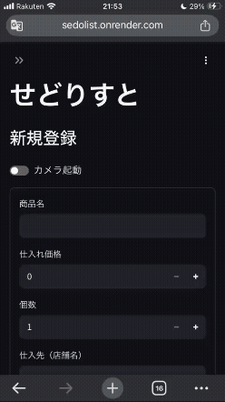
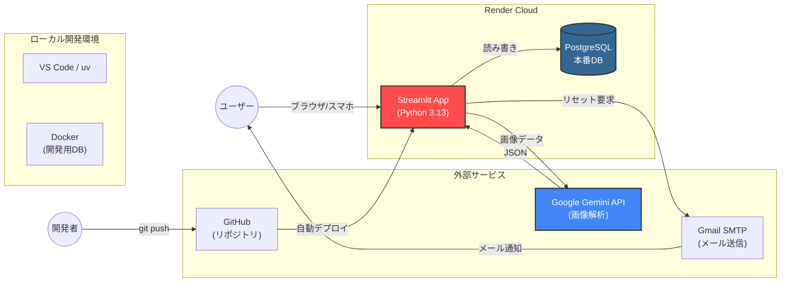
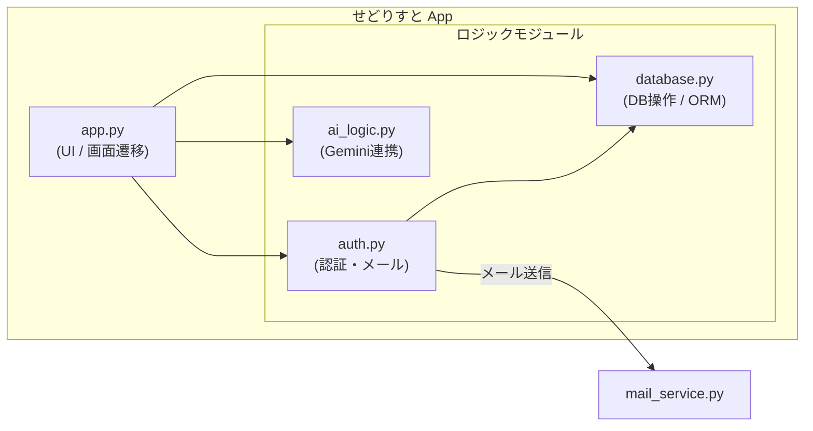
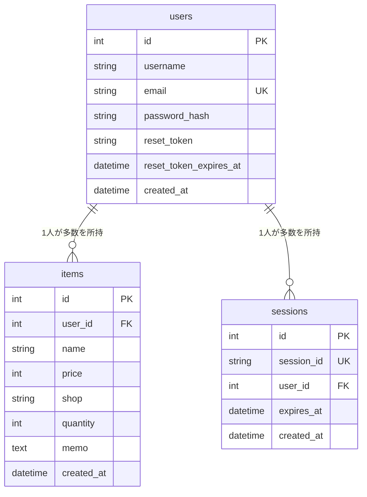
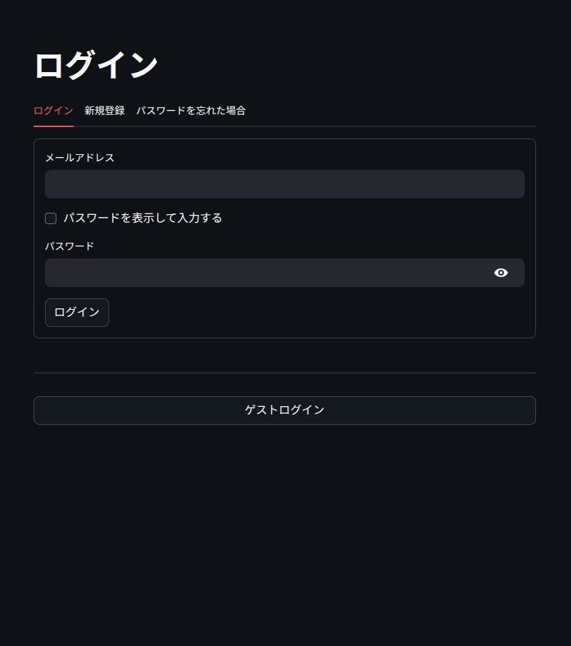
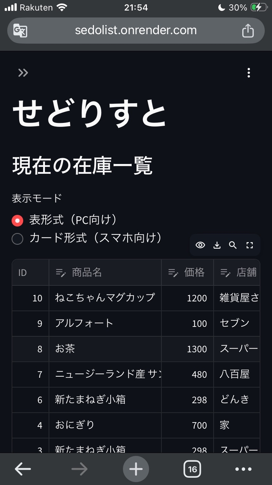
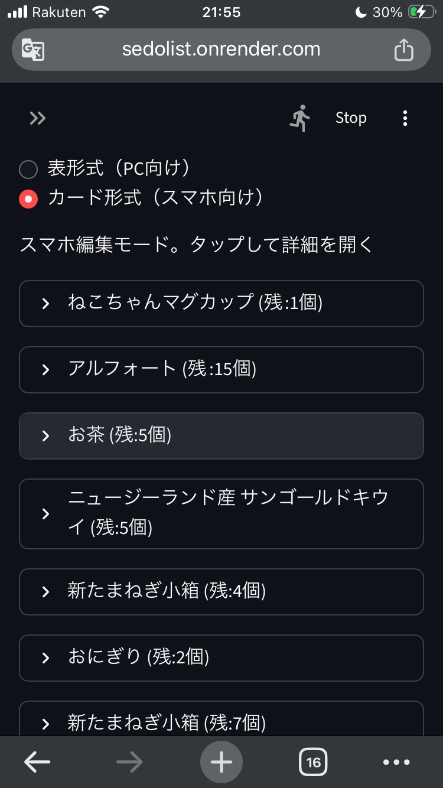
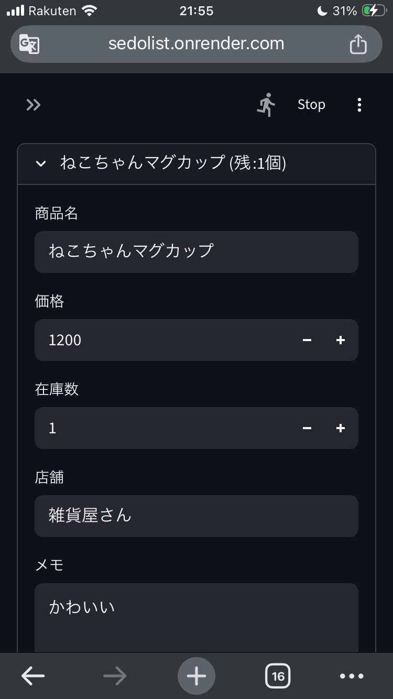
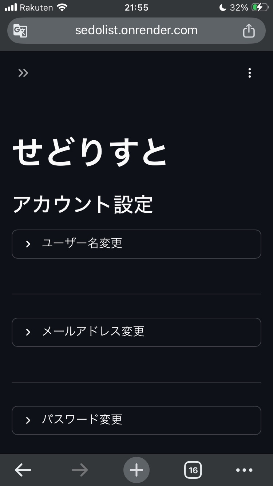
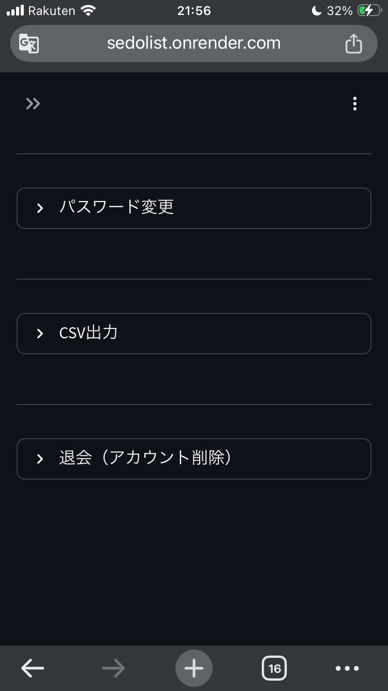

# せどりすと (Stock Manager) 📦

個人せどらー向けの在庫管理・商品登録支援アプリケーションです。
「現場で使える」をコンセプトに、スマホでの操作性やAIによる入力補助を重視して開発しました。
StreamlitによるシンプルなUIと、Google Gemini APIを活用した値札画像からの自動入力機能が特徴です。

## GitHub Actions
[](https://github.com/oshi5to01-design/stock_manager/actions/workflows/test.yml)

## 動作デモ

スマホでの操作イメージです。カメラ起動からAI解析、登録までスムーズに行えます。




## システム構成図(System Architecture)



## 内部構造図 (Internal Structure)



## ER図




## ✨ 主な機能

- **📱 スマホ完全対応**: 登録済み商品を一覧表示。PC向け（表形式）とスマホ向け（カード形式）の表示切り替えが可能。
- **AI画像解析による自動登録**: 商品の値札やパッケージをカメラ撮影/アップロードすると、Gemini APIが商品名と価格を自動抽出して入力フォームに反映します。
- **セキュリティ**: ユーザー認証（サインアップ/ログイン）、パスワードのハッシュ化、トークンベースのパスワードリセット機能。
- **データ出力**: 在庫データをCSV形式でダウンロード可能。
- **アカウント管理**: ユーザー名・メールアドレス・パスワードの変更、退会（データ全削除）。
- **データ管理**: ユーザーごとのデータ分離（マルチテナント）、SQLAlchemyによる安全なDB操作。
- **デプロイメント**: Renderを使用して、無料プランで安定して動作します。    

## 🛠 技術スタック

- **Frontend/App Framework**: [Streamlit](https://streamlit.io/)
- **Backend Language**: Python 3.13+
- **Database**: PostgreSQL
- **ORM**: SQLAlchemy
- **AI**: Google Gemini API (`google-generativeai`)
- **Infrastructure**: Docker(Local),Render(Production)
- **CI/CD**: GitHub Actions
- **Package Manager**: uv
- **Linter/Formatter**: ruff
- **Testing**: pytest
- **Mail Service**: Gmail SMTP

## 機能紹介

### 📸 ログイン画面

<p float="left">
  
</p>

### 📸 在庫一覧画面

<p float="left">
  
   
  
</p>

### 📸 設定等 

<p float="left">
  
   
</p>


## 🚀 ローカルでのセットアップ手順
uv と Docker を使用しているため、コマンド数回で環境が整います。

### 1. リポジトリのクローン
```bash
git clone <repository-url>
cd stock_manager
```

### 2. 環境構築
```bash
# uvが入っていない場合
curl -LsSf https://astral.sh/uv/install.sh | sh

# 仮想環境作成とライブラリインストールを一括実行
uv sync
```

### 3. データベースの起動(Docker)
```bash
docker compose up -d
```

### 4. 環境変数の設定
`.env` ファイルを作成し、以下の情報を記述してください。
（Dockerのデフォルト設定に合わせています）

```ini
# Database (Docker Local)
DB_HOST=localhost
DB_PORT=5432
DB_NAME=stock_db
DB_USER=user
DB_PASS=password

# Gemini API (Google AI Studioで取得)
GEMINI_API_KEY=your_gemini_api_key
```

## ▶️ アプリの起動

```bash
uv run streamlit run app.py
```
ブラウザが起動し、`http://localhost:8501` でアプリにアクセスできます。
※初回起動時にデータベースのテーブルは自動生成されます。

## 🧪 テスト実行

ロジック（DB操作、認証、AI連携）の単体テストを完備しています。

```bash
# 全テストの実行
uv run pytest
```

## 📁 ディレクトリ構成

stock_manager/ <br>
├── app.py           # メインアプリケーション (UI) <br>
├── database.py      # データベース操作 (SQLAlchemy) <br>
├── auth.py          # 認証ロジック (ログイン・登録) <br>
├── ai_logic.py      # AI連携ロジック (Gemini) <br>
├── tests/           # テストコード <br>
├── docker-compose.yml # ローカルDB構成 <br>
├── pyproject.toml   # 依存関係管理 (uv) <br>
└── requirements.txt # Renderデプロイ用 <br>

## 📝 ライセンス

MIT License
